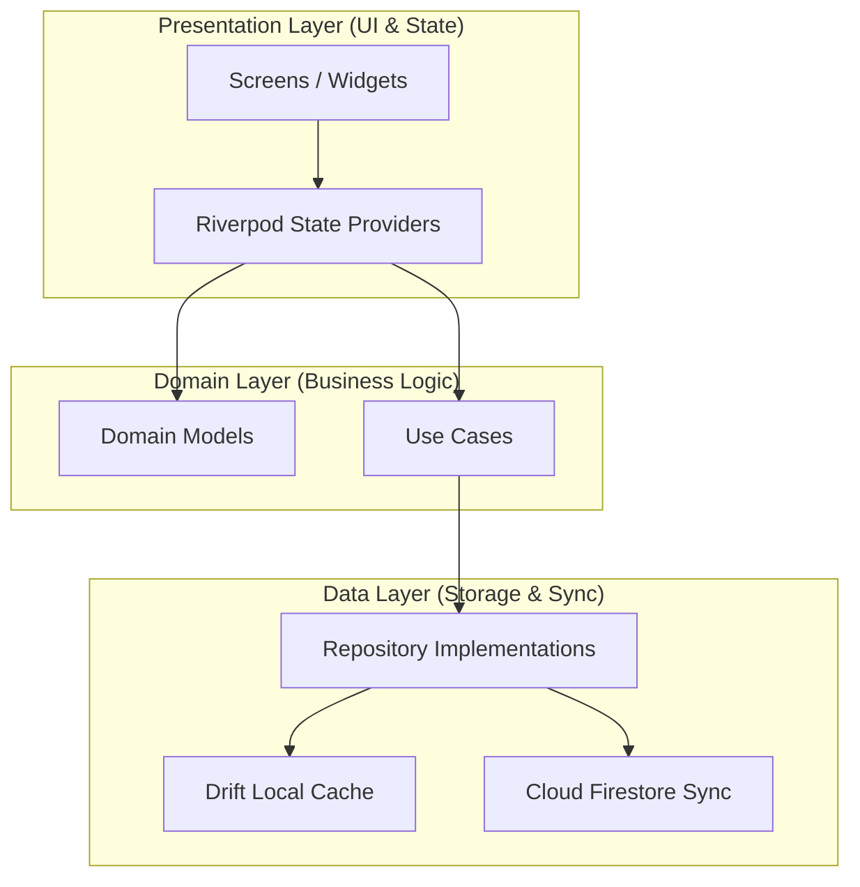

# MindVault 🧠✨

**Think. Connect. Learn. Remember.**
*Obsidian-style knowledge management meets Anki-style spaced repetition, built with a premium handwriting vector engine and real-time cloud synchronization.*

---

## 🌟 Key Features

### 🖋️ 1. Professional Handwriting & Stylus Engine
* **High-Performance Canvas**: Features a dual-layer drawing engine using `ui.Picture` caching for completed strokes and a separate dynamic layer for active stroke recording. Runs smoothly at **60fps/120fps** even with thousands of vector paths.
* **Stylus-Aware Precision**: Supports pressure sensitivity, drawing tilt, and active/passive stylus events (e.g., Apple Pencil, Samsung S Pen, Xiaomi Smart Pen).
* **Geometric Shape Rectification**: Includes a mathematical shape recognizer utilizing Ramer-Douglas-Peucker simplification, linear regression, and centroid distance variance calculations to instantly rectify hand-drawn strokes into perfect lines, circles, ellipses, rectangles, triangles, and arrows.
* **Lasso Select & Modify**: Draw arbitrary lasso loops to select vector strokes. Uses ray-casting containment checks to let you group-move, delete, or change stroke colors.
* **Template Paper Styles**: Instantly toggle templates between Ruled Notebook, Engineering Grid, and Blank Canvas.
* **PDF Annotation Overlay**: Load local PDF files as background canvas pages to annotate directly on top of slides, textbooks, or documents.
* **Sharing Exports**: Export canvas pages into high-resolution multi-page PDF documents or high-quality sharing PNGs.

### ⚡ 2. Spaced Repetition (FSRS Algorithm)
* **Scientific Spaced Repetition**: Powered by the **Free Spaced Repetition Scheduler (FSRS v2)** algorithm to optimize card review schedules based on memory decay theories.
* **Rich Flashcards**: Support for text-based cards, image occlusions, and handwritten/drawing cards grouped into customized Decks and Folders.
* **Analytical Dashboards**: Real-time study logs, review retention statistics, and daily review calendar visualizations powered by `fl_chart`.

### ☁️ 3. Cloud Persistence & Offline Sync
* **Drift SQLite Cache**: Complete offline autonomy using a local Drift database schema cache.
* **Firestore Sync Manager**: Automatically queues all local modifications and uploads them in sequence.
* **Gzip Payload Compression**: Stroke coordinate arrays are compressed with Gzip and base64-encoded under a custom `gz:` protocol, decreasing cloud network payloads by **up to 90%** and preventing Firestore document limit bottlenecks.
* **Guest Profile Bypassing**: Offline guest login paths automatically skip cloud restoration steps and bypass restrictive Firestore authentication rules, maintaining functional sandbox workflows.

### 🤖 4. AI-Enhanced Assistant
* **Gemini Integration**: Incorporates `google_generative_ai` (Gemini API) to summarize note files, extract flashcards from handwriting, suggest learning paths, and answer domain queries.

### 🌐 5. Web assembly (WASM) & Web Workers
* **Custom Web Worker**: Includes a custom-compiled web worker (`drift_worker.js`) to support SQLite operations in a separated background thread under Google Chrome.
* **Google Sign-In Web**: Preconfigured Client ID metadata tags enabling Google Auth flows inside web builds.

---

## 🏗️ Architecture

MindVault is engineered using **Clean Architecture** patterns combined with the **Repository Pattern** and **Riverpod** state management:



---

## 🚀 Getting Started

### Prerequisites
* Flutter SDK (3.16.x or newer recommended)
* Dart SDK (3.8.0+ supported)
* Firebase CLI installed and configured
* Android SDK (for APK builds) / Xcode (for iOS builds)

### 1. Repository Setup
Clone the repository and fetch dependencies:
```bash
git clone <repository_url>
cd mind_vault
flutter pub get
```

### 2. Configure Firebase
Ensure your Firebase CLI is logged in, then run:
```bash
flutterfire configure
```
Make sure Firestore rules permit reads and writes only for authenticated users:
```javascript
rules_version = '2';
service cloud.firestore {
  match /databases/{database}/documents {
    match /{document=**} {
      allow read, write: if request.auth != null;
    }
  }
}
```

### 3. Generate Code Assets
Regenerate Drift DB mappings, Freezed models, and Riverpod annotations:
```bash
dart run build_runner build --delete-conflicting-outputs
```

---

## 🛠️ Build Commands

### Compile Custom Web Worker (For Chrome/Web Builds)
To run the project on the web, you must compile the Drift web worker entrypoint:
```bash
dart compile js -O4 web/drift_worker.dart -o web/drift_worker.js
```
Then launch the development server:
```bash
flutter run -d chrome
```

### Assemble Debug Android APK
To compile the debug APK file for testing on devices or emulators:
```bash
flutter build apk --debug
```
* **Output Path**: `build/app/outputs/flutter-apk/app-debug.apk`

---

## 🧪 Running Tests
Verify the math behind shape recognition and coordinate compression:
```bash
flutter test
```
